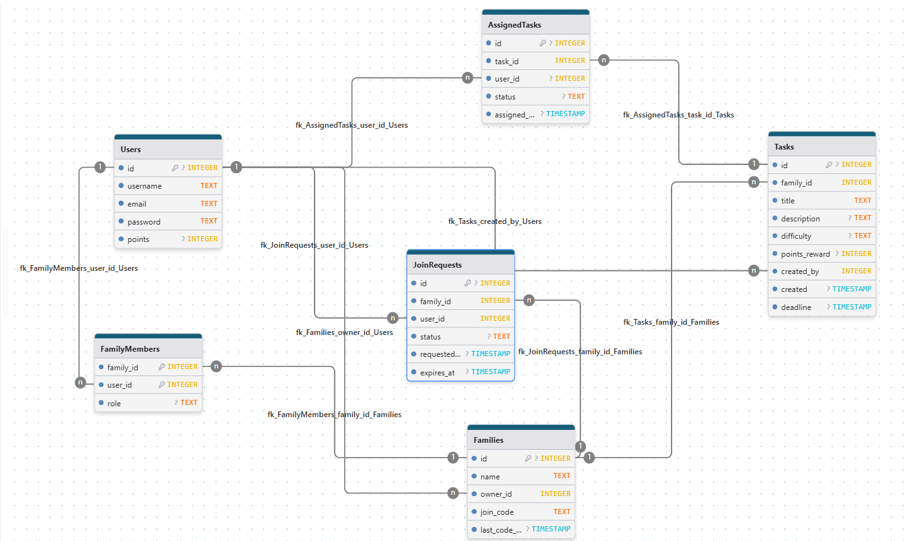

# FamilieTask 🧩

FamilieTask is an app designed to make it easy to create and share tasks among family members. The goal is to help families keep track of who is responsible for what, and when tasks need to be done.

## Project Status 📌

The project is in active development. Some key features have been implemented, providing a solid foundation for the application.

### Implemented Features:  ✔️
- **User Registration & Login:** New users can create an account and log in securely.
- **Family Creation & Management:** Logged-in users can create a family, which establishes them as the owner.
- **Full Join Request Workflow:** A complete system for users to request to join a family, and for family owners/admins to approve or reject requests.
- **Task Management API:** Backend endpoints for creating and listing family tasks, with role-based access control.
- **Admin Task UI:** The admin panel now includes functionality to create new tasks and view a list of all family tasks.
- **Secure Configuration:** Project configuration is managed securely through `.env` files.
- **Automated System Maintenance:** A periodic cleanup process automatically removes expired or rejected join requests from the database.
    - Users can request to join a family using a unique code.
    - Family `owner`s and `admin`s can view, `accept`, or `reject` these requests from a dedicated admin panel.
- **Admin Panel Placeholder:** A basic admin panel is accessible to users with admin rights, currently used for managing join requests. Also laying the groundwork for future administrative features.

### Next Steps 🚀
The next steps for the project are currently undecided. With the core user and family management system now in place, we can explore several feature directions, such as task creation, assignment, and the points-based reward system.

## ✨ Planned Features
- **Complete Family Management:** Implement the full workflow for adding, managing, and removing family members.
- **Full Task Lifecycle:** Allow users to create, assign, track progress, and review completed tasks.
- **Expanded Role Permissions:** Solidify the distinct permissions for `owner`, `admin`, and `standard` user roles.
- **Gamification System:** Build out the logic for awarding, tracking, and displaying points for task completion.
- **Notifications:** Alert users to important events like new task assignments or pending join requests.

## 💻 Technology Stack
- **Backend:** Node.js with Express
- **Database:** SQLite, accessed via the `better-sqlite3` library.
- **Frontend:** HTML, CSS, and Vanilla JavaScript utilizing the `fetch` API.
- **Authentication:** Passwords are hashed using `bcrypt`, and sessions are managed with `express-session` and `session-file-store`.

## ⚙️ How the Project Works 🛠️

The application is built with a Node.js and Express backend, a SQLite database, and a frontend using HTML, CSS, and vanilla JavaScript.

### Backend (app.js) ⚙️

The main server file `app.js` handles routing, middleware, and database interactions.

#### 1. User Registration (`/register`) 📝
This endpoint handles new user creation. It checks if the user already exists, hashes the password using `bcrypt`, and stores the new user in the `Users` table.

```javascript
// Registration route
app.post('/register', async (req, res) => {
    const { username, email, password } = req.body;

    if (!username || !email || !password) {
        return res.status(400).json({ message: 'Please provide all required fields.' });
    }

    try {
        // Check if user already exists
        const stmt_find = db.prepare('SELECT * FROM users WHERE email = ?');
        const existingUser = stmt_find.get(email);

        if (existingUser) {
            return res.status(409).json({ message: 'User with this email already exists.' });
        }

        // Hash the password
        const saltRounds = 10;
        const hashedPassword = await bcrypt.hash(password, saltRounds);

        // Insert new user into the database
        const stmt_insert = db.prepare('INSERT INTO users (username, email, password) VALUES (?, ?, ?)');
        stmt_insert.run(username, email, hashedPassword);

        res.status(201).json({ message: 'User registered successfully!' });

    } catch (error) {
        console.error('Registration error:', error);
        res.status(500).json({ message: 'Internal server error' });
    }
});
```

#### 2. User Login (`/login`) 🔐
Handles user authentication. It verifies credentials and, upon success, creates a session. It also checks if the user is part of a family and redirects them accordingly (`/dashboard.html` or `/createNewFamily.html`).

```javascript
// Login route
app.post('/login', async (req, res) => {
    const { email, password } = req.body;

    if (!email || !password) {
        return res.status(400).json({ message: 'Email and password are required.' });
    }

    try {
        const userStmt = db.prepare('SELECT * FROM Users WHERE email = ?');
        const user = userStmt.get(email);

        if (!user) {
            return res.status(401).json({ message: 'Invalid credentials.' });
        }

        const passwordMatch = await bcrypt.compare(password, user.password);

        if (!passwordMatch) {
            return res.status(401).json({ message: 'Invalid credentials.' });
        }

        req.session.user = {
            id: user.id,
            username: user.username,
            email: user.email
        };

        // Sjekk familie medlemskap
        const familyStmt = db.prepare('SELECT family_id FROM FamilyMembers WHERE user_id = ?');
        const familyMembership = familyStmt.get(user.id);

        // Velg redirect URL basert på familie medlemskap
        const redirectUrl = familyMembership ? '/dashboard.html' : '/createNewFamily.html';

        res.status(200).json({ message: 'Login successful!', redirectUrl });

    } catch (error) {
        console.error('Login error:', error);
        res.status(500).json({ message: 'Internal server error' });
    }
});
```

#### 3. Family Creation (`/createFamily`) 🏠
Allows a logged-in user to create a new family. It generates a unique, random join code for the family.

```javascript
// Create Family Route 
app.post('/createFamily', requireLogin, (req, res) => {
    const { familyName } = req.body;
    const userId = req.session.user.id;

    // 1. Validate family name
    const trimmedName = familyName ? familyName.trim() : '';
    if (trimmedName.length < 2 || trimmedName.length > 50) {
        return res.status(400).json({ message: 'Family name must be between 2 and 50 characters.' });
    }

    try {
        // 2. Generer en unik join-kode
        let joinCode;
        let isUnique = false;
        const findCodeStmt = db.prepare('SELECT id FROM Families WHERE join_code = ?');
        while (!isUnique) {
            joinCode = crypto.randomBytes(6).toString('hex').toUpperCase(); // 12-char code
            const existingFamily = findCodeStmt.get(joinCode);
            if (!existingFamily) {
                isUnique = true;
            }
        }

        // 3. Bruke transaksjon for å opprette familie og legge til eier som medlem
        const createFamilyTx = db.transaction(() => {
            const insertFamilyStmt = db.prepare(
                'INSERT INTO Families (name, owner_id, join_code, last_code_update) VALUES (?, ?, ?, ?)'
            );
            const info = insertFamilyStmt.run(trimmedName, userId, joinCode, new Date().toISOString());
            const familyId = info.lastInsertRowid;

            const insertMemberStmt = db.prepare(
                'INSERT INTO FamilyMembers (family_id, user_id, role) VALUES (?, ?, ?)'
            );
            insertMemberStmt.run(familyId, userId, 'owner');
        });

        createFamilyTx();

        // 4. Svar til klienten
        res.status(201).json({ message: 'Family created successfully!', redirectUrl: '/dashboard.html' });

    } catch (error) {
        console.error('Family creation error:', error);
        res.status(500).json({ message: 'Internal server error during family creation.' });
    }
});
```

#### 4. Join Family Request (`/join-request`) ➕
Allows a logged-in user to send a request to join a family using its join code. The request is stored in the `JoinRequests` table with a `pending` status.

```javascript
// Join Family Route
app.post('/join-request', requireLogin, (req, res) => {
    const { joinCode } = req.body;
    const userId = req.session.user.id;

    if (!joinCode || joinCode.trim().length === 0) {
        return res.status(400).json({ message: 'Join code is required.' });
    }

    try {
        // Finn familie basert på join-koden
        const familyStmt = db.prepare('SELECT id FROM Families WHERE join_code = ?');
        const family = familyStmt.get(joinCode.trim().toUpperCase());

        // Hvis det ikke er en familie med den join-koden send 404 error
        if (!family) {
            return res.status(404).json({ message: 'Invalid join code.' });
        }

        const familyId = family.id;

        // Sjekk om brukeren allerede er medlem av familien
        const memberSql = 'SELECT 1 FROM FamilyMembers WHERE family_id = ? AND user_id = ?';
        const memberStmt = db.prepare(memberSql).get(familyId, userId);

        if (memberStmt) {
            return res.status(409).json({ message: 'You are already a member of this family.' });
        }

        // Sjekk om det allerede finnes en ventende forespørsel
        const requestSql = `SELECT 1 FROM JoinRequests WHERE family_id = ? AND user_id = ? AND status = 'pending'`;
        const existingRequest = db.prepare(requestSql).get(familyId, userId);

        if (existingRequest) {
            return res.status(409).json({ message: 'You already have a pending join request for this family.' });
        }

        const insertSql = `
            INSERT INTO JoinRequests (family_id, user_id, status, expires_at) 
            VALUES (?, ?, 'pending', DATETIME('now', '+7 days'))
        `;
        db.prepare(insertSql).run(familyId, userId);

        // Sender suksessrespons
        res.status(200).json({ 
            success: true,
            message: 'Join request sent successfully! The family owner has been notified.' 
        });

    } catch (error) {
        console.error('Join request error:', error);
        res.status(500).json({ message: 'Server error while processing join request.' });
    }
});
```

### API Endpoints 🌐
The application also exposes API endpoints to provide data to the frontend dynamically.
- **`GET /api/join-requests`**: Fetches pending join requests for family admins.
- **`GET /api/user/permissions`**: Checks if the current user has admin rights to determine whether to show admin-only UI elements.


---
 # FamilieTask App - Database Documentation 🗄️

This part of the document describes the structure of the database used in the FamilieTask App. The database tables and columns below are aligned with the current SQLite schema.

---

### Database Visual Diagram 🧭
This diagram illustrates the relationships between the tables in the `FamilieTask_database.db` SQLite database.



You can view and edit the diagram here: [DrawDB Link](https://www.drawdb.app/editor?shareId=4c93190b4986266e6fac4d060955f1f9)


---

## 🧑‍💻 Users Table

Stores information about users.

| Column    | Type    | Description                              |
|-----------|---------|------------------------------------------|
| id        | INTEGER | Primary key, autoincrement               |
| username  | TEXT    | Username, cannot be null                 |
| email     | TEXT    | User's email, must be unique             |
| password  | TEXT    | User's password, cannot be null          |
| points    | INTEGER | Accumulated points for gamification, default: 0 |

---

## 🏠 Families Table

Stores information about families.

| Column | Type    | Description                        |
|--------|---------|------------------------------------|
| id     | INTEGER | Primary key, autoincrement         |
| name   | TEXT    | Name of the family, cannot be null |
| owner_id | INTEGER | References `Users(id)` — family owner |
| join_code | TEXT | Unique join code for invitations   |
| last_code_update | TIMESTAMP | Timestamp of last join_code update |

---

## 👨‍👩‍👧‍👦 FamilyMembers Table

Manages which users are members of which families and their roles.

| Column     | Type    | Description                                                              |
|------------|---------|--------------------------------------------------------------------------|
| family_id  | INTEGER | References `Families(id)`                                                 |
| user_id    | INTEGER | References `Users(id)`                                                   |
| role       | TEXT    | Role in the family: `'admin'` or `'standard'` (default: `'standard'`)    |

Primary key: composite (`family_id`, `user_id`).

---

**Notes:**  
- The `owner` of a family is stored on the `Families.owner_id` column; `FamilyMembers` tracks membership and member-level roles (`admin`, `standard`).
- `admin` can assign tasks and manage members; `standard` represents regular members.

---

## ✅ Tasks Table

Stores task definitions that belong to a family.

| Column        | Type    | Description                                               |
|---------------|---------|-----------------------------------------------------------|
| id            | INTEGER | Primary key, autoincrement                                |
| family_id     | INTEGER | References `Families(id)`                                 |
| title         | TEXT    | Task title, cannot be null                                |
| description   | TEXT    | Optional description of the task                          |
| difficulty    | TEXT    | Difficulty: `light`, `easy`, `medium`, `hard` (default: `medium`) |
| points_reward | INTEGER | Points awarded for completing the task (default: 10)      |
| created_by    | INTEGER | References `Users(id)` — who created the task (NOT NULL)  |
| created       | TIMESTAMP | Creation timestamp, default: CURRENT_TIMESTAMP         |
| deadline      | TIMESTAMP | Optional deadline                                      |

---

## 📝 AssignedTasks Table

Tracks assignment of tasks to users and the assignment lifecycle.

| Column        | Type    | Description                                                      |
|---------------|---------|------------------------------------------------------------------|
| id            | INTEGER | Primary key, autoincrement                                       |
| task_id       | INTEGER | References `Tasks(id)`                                           |
| user_id       | INTEGER | References `Users(id)` — may be NULL if unassigned              |
| status        | TEXT    | `not_assigned`, `pending`, `completed`, `approved` (default: `not_assigned`) |
| assigned_date | TIMESTAMP | Timestamp when assignment created (default: CURRENT_TIMESTAMP) |

---

## 🔔 JoinRequests Table

Tracks requests from users to join a family (used for approval flows).

| Column      | Type    | Description                                              |
|-------------|---------|----------------------------------------------------------|
| id          | INTEGER | Primary key, autoincrement                               |
| family_id   | INTEGER | References `Families(id)`                                |
| user_id     | INTEGER | References `Users(id)`                                  |
| status      | TEXT    | `pending`, `approved`, `rejected` (default: `pending`)  |
| requested_at| TIMESTAMP | When the request was made (default: CURRENT_TIMESTAMP) |
| expires_at  | TIMESTAMP | When the request expires (default: now + 7 days)       |

---

## 🔗 Relationships

The database schema is designed with the following relationships, enforced by foreign keys:

- **`Families` -> `Users`**:
  - `Families.owner_id` references `Users.id` to designate the family's owner.

- **`FamilyMembers` -> `Users` & `Families`**:
  - `FamilyMembers.user_id` references `Users.id`.
  - `FamilyMembers.family_id` references `Families.id`.
  - This table acts as a junction table to resolve the many-to-many relationship between `Users` and `Families`. While a simpler design might have avoided this table (e.g., if a user could only belong to one family), this approach provides excellent scalability, allowing a user to be a member of multiple families seamlessly.

- **`Tasks` -> `Families` & `Users`**:
  - `Tasks.family_id` references `Families.id` to associate a task with a family.
  - `Tasks.created_by` references `Users.id` to indicate who created the task.

- **`AssignedTasks` -> `Tasks` & `Users`**:
  - `AssignedTasks.task_id` references `Tasks.id`.
  - `AssignedTasks.user_id` references `Users.id`, linking a user to a specific task assignment.

- **`JoinRequests` -> `Users` & `Families`**:
  - `JoinRequests.user_id` references `Users.id`.
  - `JoinRequests.family_id` references `Families.id`.
  - This table manages pending requests from users who want to join a family.
---


